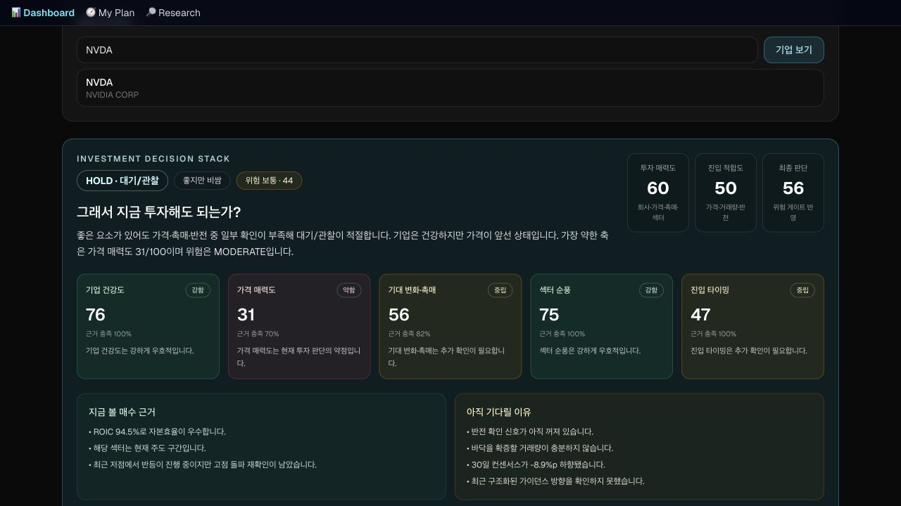
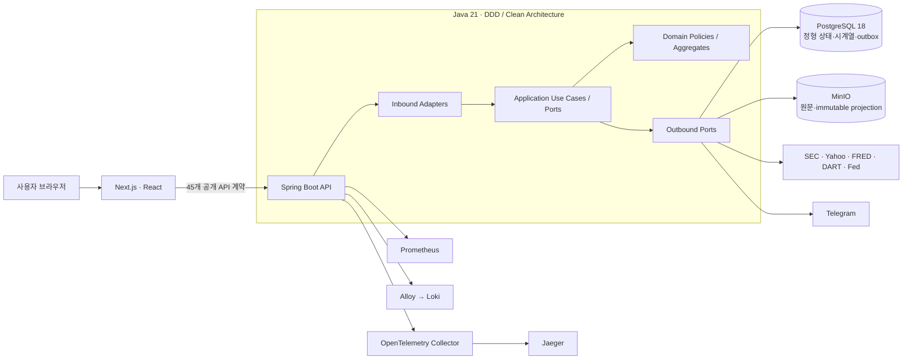
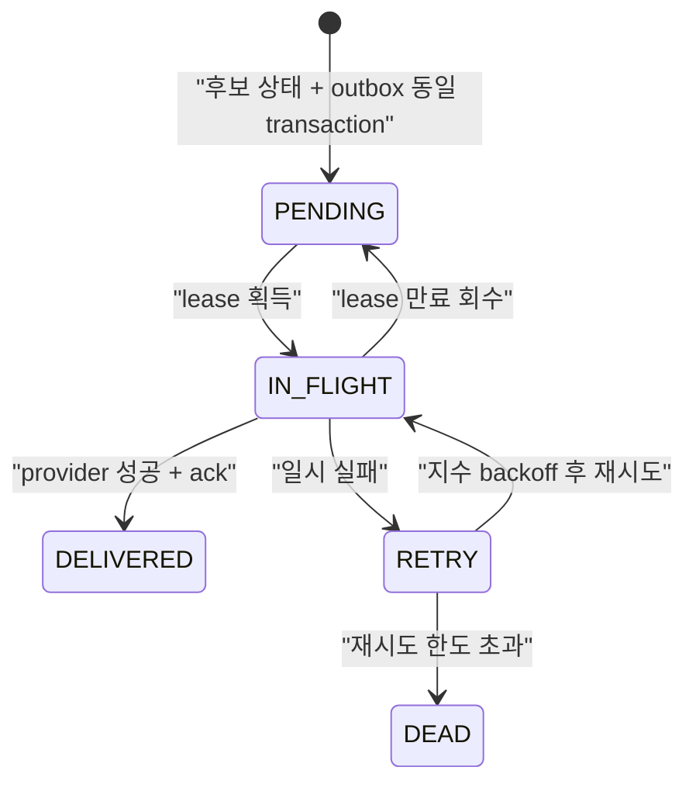
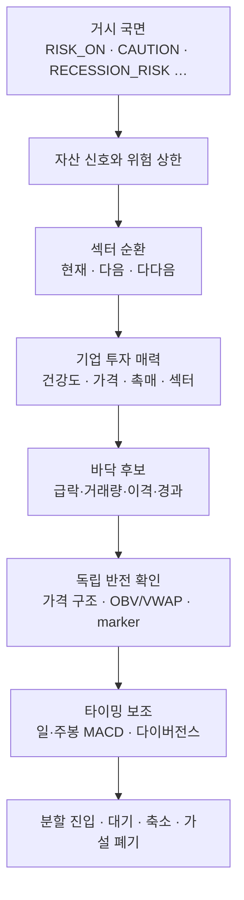
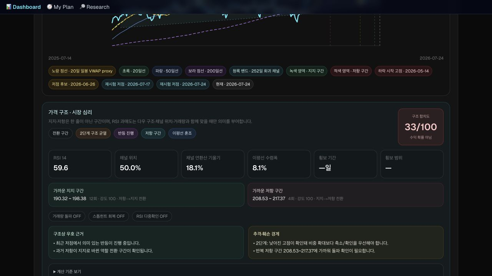
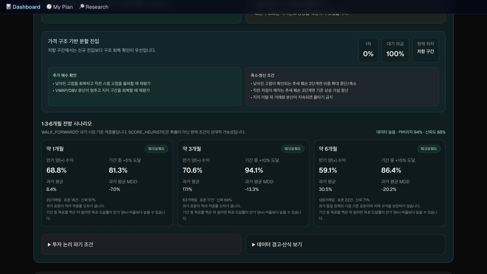
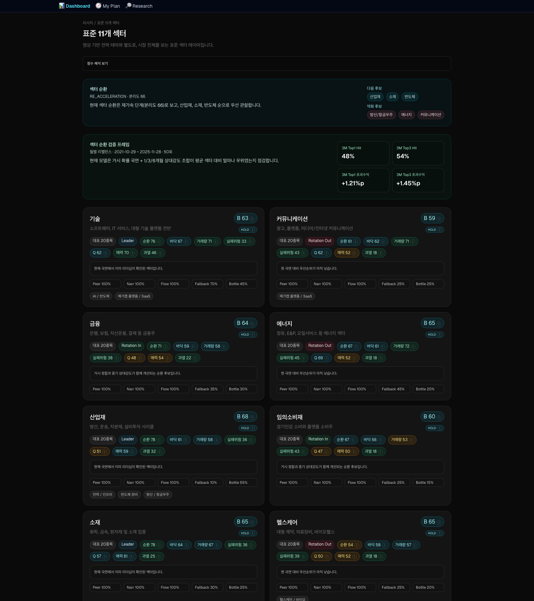
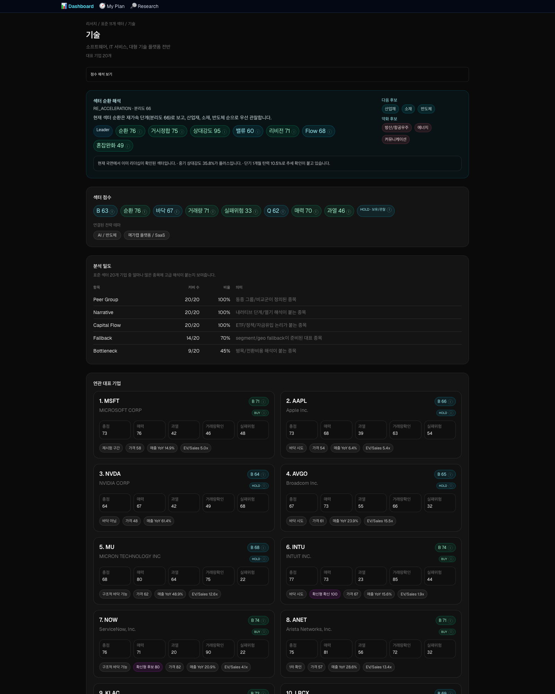

# MacroSquare — 데이터 신뢰성과 운영 안전성을 중심으로 설계한 투자 의사결정 플랫폼

> 거시경제·유동성·가격·기업 펀더멘털·수급 데이터를 결합해 **“지금 무엇을 살 것인가”보다 “현재 어떤 위험을 감수할 수 있고, 언제·얼마나 진입할 것인가”**를 설명하는 풀스택 금융 리서치 시스템



## 1. 프로젝트 한눈에 보기

| 항목 | 내용 |
|---|---|
| 프로젝트 | MacroSquare |
| 형태 | 개인용 프로덕션 금융 리서치·포트폴리오 의사결정 플랫폼 |
| 작업 기간 | 2026.04–2026.08 포트폴리오 스냅샷 |
| 포트폴리오 포지션 | 제품 설계 · 도메인 모델링 · 풀스택 개발 · 데이터 엔지니어링 · 홈서버 운영 |
| Backend | Java 21, Spring Boot 4.1, Spring Framework 7, JDBC, Flyway, Maven Multi-module |
| Frontend | Next.js 16, React 19, TypeScript, Tailwind CSS |
| Data | PostgreSQL 18, MinIO S3-compatible object storage |
| Observability | Spring Actuator, Micrometer, OpenTelemetry, Prometheus, Loki, Alloy, Jaeger |
| Delivery | Docker Compose, 변경 범위 기반 테스트·배포, 자동 롤백, 백업·복원 리허설 |
| 핵심 규모 | 기업 277개, 표준 섹터 11개, 전략 테마 6개, 주요 13F 관리자 20곳, 공개 API 45개 |
| 품질 기준선 | Java Surefire 750 tests / failures 0 / errors 0, ArchUnit 6 rules, 운영 smoke 43 checks |

> **수치 해석:** 테스트·운영 수치는 지정 세션 `019fe11e-396d-7373-91eb-d21a348c69cd`와 해당 작업 트리의 2026-08-22 상태를 기준으로 정리했다. 외부 포트폴리오에 게시하기 전 [근거와 측정 기준](docs/portfolio/EVIDENCE-AND-METRICS.md)을 함께 확인한다.

## 2. 30초 소개

MacroSquare는 여러 금융 지표를 한 화면에 나열하는 대시보드가 아니라, **데이터의 기준일·신선도·결측·실패 의미를 보존한 채 투자 판단으로 변환하는 의사결정 시스템**입니다. 기존 TypeScript 백엔드를 Java/Spring 기반 멀티모듈 구조로 전환하고, 도메인·애플리케이션·어댑터·부트스트랩 경계를 ArchUnit으로 강제했습니다. 정형 상태는 PostgreSQL에, SEC/IR 원문과 immutable projection은 MinIO에 분리했으며, 스케줄러 중복 실행·동시 수정 유실·알림 소실을 advisory lock, row lock, transactional outbox로 해결했습니다. 금융 모델은 미래 데이터 누수를 막는 point-in-time 원칙과 fail-closed 정책을 적용하고, 홈서버에서 수집·분석·알림·관측·백업까지 운영합니다.

## 3. 해결하려 한 문제

투자 판단은 보통 세 가지 문제를 동시에 가집니다.

1. **정보가 흩어져 있다.** 금리, 유동성, 변동성, 섹터, 기업 실적, 가격 구조가 서로 다른 출처와 주기로 갱신된다.
2. **숫자의 의미가 섞인다.** 현재값, 후행값, proxy, heuristic, 검증된 통계가 같은 점수처럼 보이면 과신을 만든다.
3. **운영 실패가 곧 잘못된 판단이 된다.** 공급자 장애, stale cache, 기업분할, 부분 배치 성공, 중복 스케줄 실행이 거짓 BUY 또는 중복 알림으로 이어질 수 있다.

MacroSquare는 이 문제를 다음 원칙으로 해결했다.

- **원천 → 정규화 → 도메인 정책 → 영속 projection → API → UI** 계보를 유지한다.
- 데이터가 없을 때 0이나 중립값을 꾸며내지 않고 `UNAVAILABLE`, `DEGRADED`, `LIMITED`를 구분한다.
- 좋은 점수보다 **현재성·가격 구조·거래량·위험 gate**를 우선한다.
- 한 번의 점수로 자동매매하지 않고, 국면·자산·섹터·기업·타이밍을 분리해 판단한다.
- 장애 수정은 코드 패치로 끝내지 않고 **재현 테스트 + DB 제약 + 운영 탐지**까지 남긴다.

## 4. 제품 범위

### 4.1 시장·자산 판단

- FRED, Yahoo, CNN Fear & Greed, CBOE, AAII/NAAIM, KRX 수급 등 다중 원천 수집
- 금리·유동성·고용·신용·변동성·가격을 조합한 거시 국면 분류
- NASDAQ, KOSPI, 금, 은, 구리, 신흥국, 현금, 레버리지 자산 신호
- 국면별 기본 비중과 신호 multiplier, 최소 현금·위험 상한을 반영한 배분
- 일봉·주봉 MACD 교차, 히스토그램 확대/수축, 확인된 다이버전스 노출

### 4.2 섹터·기업 리서치

- 표준 11개 섹터와 전략 테마 6개를 분리해 순환·상대강도·거시 적합·수급·breadth 평가
- 277개 기업의 SEC 재무·공시, Yahoo 가격·컨센서스, guidance, revenue mix, peer 비교
- 기업 건강도, 가격 매력도, 기대 변화·촉매, 섹터 순풍, 진입 타이밍을 독립 축으로 계산
- 급락 강도를 보는 **바닥 후보**와 실제 가격·수급 회복을 보는 **반전 확인**을 분리
- 단기·스윙·장기 시나리오와 분할 진입·가설 폐기 조건 제공

### 4.3 기관·정책·공시

- SEC 13F-HR 원문과 holdings를 수집해 20개 주요 운용사의 신규·증가·축소·청산 분류
- Fed·Treasury·USTR 공식 원문을 설명 가능한 tone·confidence로 정규화
- OpenDART 공시·연결재무를 선택적 통합으로 제공
- Google News RSS·Wikimedia Pageviews·선택적 YouTube API를 사용한 narrative 관측

### 4.4 실행·알림·운영

- 투자 계획, 분할 매수 tranche, 거래 로그, 구매력 계산
- 기업·코인 후보 신규 편입, 반전 `ON→STRONG`, 5점 점수 구간 강화 Telegram 알림
- startup snapshot과 무거운 전체 재계산을 분리해 빠른 기동과 provider 보호 동시 달성
- Prometheus/Loki/Jaeger 기반 지표·로그·트레이스, 1분 recurrence monitor, 일일 감사
- PostgreSQL·MinIO 일관 백업과 별도 볼륨 restore drill

## 5. 전체 아키텍처



핵심 의존 방향은 다음 한 줄로 고정했다.

```text
bootstrap → adapters → application → domain
```

- `domain`: 순수한 value object, aggregate, 금융 policy와 불변식
- `application`: use case, command/query, 입출력 port, 트랜잭션 의미
- `adapters`: REST, scheduler, 외부 API, JDBC, MinIO, Telegram, JSON mapping
- `bootstrap`: Bean 조립, configuration, health, Flyway, lifecycle
- `architecture-tests`: 프레임워크 누수와 bounded-context 침범을 빌드에서 차단

상세 다이어그램은 [아키텍처 다이어그램 모음](docs/portfolio/ARCHITECTURE-DIAGRAMS.md)에 있다.

## 6. 핵심 기술 의사결정

### 6.1 단순 번역이 아닌 Java/Spring 운영 백엔드로 전환

기존 Node/TypeScript 구현의 HTTP 계약만 흉내 내는 bridge를 만들지 않았다. 공개 API, 수집, 계산, 영속화, Telegram 책임을 Spring이 직접 소유하도록 전환했다.

- Maven 멀티모듈로 컴파일 수준 의존 방향을 분리
- 생성자 주입과 명시적 composition root 사용
- domain/application에서 Spring, Jackson, JDBC, MinIO, HTTP, 파일 타입 금지
- bounded context 간 결합은 port 또는 outer anti-corruption adapter로만 허용
- ArchUnit 6개 규칙으로 경계를 자동 검사
- 운영 이미지에서 Node backend bridge와 subprocess 제거

**왜 중요한가:** 파일을 계층별 폴더로 나누는 데 그치지 않고, 잘못된 의존이 추가되면 빌드가 실패하도록 설계 철학을 실행 가능한 규칙으로 만들었다.

### 6.2 PostgreSQL과 MinIO의 저장 책임 분리

모든 데이터를 RDB BLOB 또는 파일에 몰아넣지 않았다.

| 저장소 | 소유 데이터 |
|---|---|
| PostgreSQL | 시장 시계열, 기업 요약, analyst history, 투자계획, 알림 상태/outbox, object metadata·active pointer |
| MinIO | SEC/IR PDF·HTML·XML 원문, source cache, immutable/versioned JSON projection body |

MinIO body를 먼저 저장하고 SHA-256·ETag·version·size를 검증한 후 PostgreSQL pointer를 transaction으로 활성화한다. XA/2PC는 도입하지 않았고, pointer commit 전 object는 reader에게 보이지 않으므로 실패 시 기존 last-valid를 보존한다. orphan은 운영 GC 대상으로 다루고 dangling pointer는 무결성 위반으로 감지한다.

### 6.3 금융 의사결정에서 fail-closed를 기본값으로 사용

금융 서비스에서 “일단 보여주기”는 거짓 확신이 될 수 있다. 따라서 다음 상황은 좋은 과거 점수를 재사용하지 않고 BUY를 닫는다.

- 가격 기준일 또는 재무 기준일이 허용 window 초과
- 현재 알려진 보고서보다 정규화 재무가 뒤처짐
- split형 가격 불연속 검증 실패
- 가격 구조·거래량·반전 근거 중 하나가 불완전
- 공급자 요청 제출 자체가 executor 포화로 거절
- 섹터 근거 coverage가 임계값 미달

last-valid는 감사와 UI 연속성을 위해 보존할 수 있지만 `eligibleForDecision=false`를 유지한다.

### 6.4 동시성·멀티 인스턴스 안전성

- I/O 병렬 작업은 Java 21 virtual thread를 사용할 수 있게 하되 provider별 semaphore와 throttle 적용
- `parallelStream`과 global common pool 금지
- 동일 ticker/source refresh는 single-flight
- scheduler는 JVM non-overlap guard + PostgreSQL session advisory lock
- 장시간 scheduler lock connection은 Hikari transaction pool과 분리, fair semaphore 4개로 제한
- 투자 계획 partial PATCH는 transaction advisory lock + `SELECT FOR UPDATE` + version으로 필드 유실 방지
- 알림 dispatcher는 `FOR UPDATE SKIP LOCKED` lease로 다중 worker 경쟁 제어

**선택한 실패 의미:** DB coordination을 얻지 못했을 때 로컬 실행으로 우회하지 않는다. 일시적 미실행보다 중복 주문성 부수효과·중복 알림이 더 위험하기 때문이다.

### 6.5 transactional outbox로 알림 상태와 발송 요청을 원자화

초기 구조의 “상태를 먼저 저장하고 Telegram을 보냄” 방식은 전송 실패 시 알림이 영구 소실될 수 있었다. 이를 다음 상태 기계로 바꿨다.



Telegram이 idempotency key를 지원하지 않아 provider 수락 직후 DB ack 전 프로세스가 죽는 극소 중복 창은 남는다. 이 한계를 숨기지 않고 **at-least-once** 전달 의미로 문서화했다.

### 6.6 point-in-time 금융 모델과 모델 거버넌스

- 신호일 당시 공개·수집 가능했던 데이터만 사용
- 저빈도 데이터는 관측일과 실제 발표/공시 가능일을 분리
- 데이터 배열 index가 아니라 날짜 교집합 또는 `latest known before signal date`로 정렬
- 현재 constituent·현재 revision을 과거 전체에 붙이는 pseudo backtest 금지
- `WALK_FORWARD`, `SCORE_HEURISTIC`, `proxy`, `reference`, `stale` 의미를 구분
- 방법론 변경 시 ADR/PDR, methodology version, golden fixture, immutable OOS ledger를 함께 갱신

섹터 순환은 완료 공통 거래일별로 `run + 11 items`를 한 transaction에 append하고, 실제 21/63/126 세션이 지난 뒤 outcome만 추가한다. GET 요청이 검증 원장을 쓰지 않으며 과거 결과를 현재 모델 성과로 재명명하지 않는다.

## 7. 금융 도메인 설계

### 7.1 다층 의사결정 스택



### 7.2 바닥과 반전 분리

급락이 크다는 사실은 “많이 떨어졌다”는 증거이지 “반등이 확인됐다”는 증거가 아니다. 따라서 두 상태를 분리했다.

- `CANDIDATE / CONVICTION`: 급락, 거래량, 낙폭 축소, 이동평균 이격, 신호 경과로 바닥 강도 평가
- `EARLY / ON / STRONG`: 확인 marker, 독립 가격 구조, OBV/VWAP, 종합 반전 점수로 후속 회복 평가
- `STRONG`: 확신형 바닥 + 구조적 바닥 + marker + 수급 72+ + 가격구조 68+ + 종합 78+
- `ON`: 바닥 후보 이상 + 1차/구조 확인 + marker + 수급 62+ + 가격구조 60+ + 종합 68+

Telegram 기업 후보는 총점 70+, B점수 70+, 바닥 후보 이상, 반전 `ON` 이상을 요구한다. 실행 액션·섹터·MACD는 알림 필터가 아니라 교차 확인 근거로 노출한다. 이는 알림을 자동 주문과 분리한 제품 결정이다.

### 7.3 MACD를 점수가 아닌 독립 타이밍 근거로 제공

- 일봉·주봉 MACD 12·26·9 공통 kernel
- 상방 골든크로스/하방 데드크로스와 교차일·경과 거래일
- 히스토그램 양/음 영역의 확대·수축
- 가격과 히스토그램의 일반 상승/하락 다이버전스
- 우측 pivot이 확인된 뒤에만 다이버전스를 활성화해 미래 데이터 누수 방지
- 기존 50/200 이동평균 cross와 이름·의미 분리
- 장기 검증 전까지 Company/B/바닥 점수에 섞지 않음

## 8. 운영·성능 개선 사례

### 8.1 홈서버 팬 소음에서 시작한 CPU 병목 제거

관측 결과 매시간 기업 후보 재계산과 30분 주기의 기업 요약 갱신이 277개 기업의 5년 워크포워드 계산을 반복하고 있었다.

개선 내용:

- 목록용 현재 요약 경로에서 불필요한 5년 워크포워드 계산 제거
- 기업 상세의 검증 정보는 유지해 사용자 정보량 보존
- 완전한 최신 V22 기업 요약이 있으면 Telegram scan이 점수·바닥·반전·MACD 증거 재사용
- 기업 요약 동시성 8→4, provider-heavy startup 작업을 3분/15분/20분으로 stagger
- 공통 advisory slot으로 company summary·analyst·candidate provider 호출 직렬화
- 재배포 시 20개 manager가 모두 최근 2시간 이내일 때만 13F 약 9만 holdings 재처리 생략

세션 실측에서 Java 서버 평균 CPU가 **약 10.55% → 2.82%**, 약 **73% 감소**했다. 데이터 주기와 기업 상세 정보는 줄이지 않았다.

### 8.2 변경 범위 기반 배포

작은 수정에도 전체 테스트·전체 이미지 빌드·전체 재배포가 반복되던 문제를 다음처럼 분리했다.

| 변경 | 기본 경로 |
|---|---|
| 문서 | 문서 검증·동기화, 앱 재시작 없음 |
| 운영 스크립트 | Python/Shell 테스트·동기화 |
| Spring | 영향/전체 backend gate 후 server만 배포 |
| Frontend | test/lint/build 후 client만 배포 |
| Flyway·persistence | release tier + 실제 PostgreSQL 통합 + 백업 확인 |
| compose·공통 계약 | full 배포 + 전체 검증 |

새 server readiness를 확인한 뒤 client를 교체하며, 실패 시 직전 compose·observability config·image tag로 자동 롤백한다. 데이터 volume은 롤백 과정에서 삭제하지 않는다.

### 8.3 디스크·백업 운영

- Docker dangling volume·build cache·미사용 image를 분리 감사
- 운영 volume과 검증된 backup은 보존한 채 약 **310GB 회수**
- PostgreSQL custom dump와 MinIO active version/checksum manifest를 동일 timestamp로 묶음
- backend pause를 관계형 dump/pointer capture 구간으로만 축소해 실측 약 2초
- 20,048개 백업 파일 checksum 검증과 disposable volume restore drill 수행

## 9. 검증 전략

| 계층 | 검증 대상 |
|---|---|
| Domain | 경계값, 결측, NaN/Infinity, 미래정보 미사용, 위험 gate, 금융 불변식 |
| Application | use case, last-valid/fail-closed, partial failure, single-flight, outbox orchestration |
| Adapter | 외부 응답 shape, malformed fixture, SQL/MinIO transaction, REST mapping, secret redaction |
| Architecture | 의존 방향, 프레임워크 누수, controller 위치, scheduler lock port, context 경계 |
| Integration | PostgreSQL 18 Flyway, multi-instance lock, concurrent PATCH, outbox lease, object pointer |
| API/UI | 45개 route ownership, 43 smoke checks, 277개 E2E 정합, Next build/lint/test |
| Operations | health/restart/OOM, ERROR/FATAL, outbox stuck, dangling pointer, metrics/logs/traces |

2026-08-22 작업 트리의 Surefire report 기준:

- Domain 265
- Application 162
- Adapters 291 — 외부 통합 18개는 표준 실행에서 skip하고 별도 PostgreSQL 스크립트로 실행
- Bootstrap 26
- Architecture 6
- **총 750, failure 0, error 0**

## 10. 정량 성과

| 구분 | 결과 | 해석 |
|---|---:|---|
| Java 테스트 | 750 | Surefire 등록 수, failure/error 0 |
| 아키텍처 규칙 | 6 | DDD/Clean 경계를 빌드에서 강제 |
| 공개 API | 45 | route ownership test로 누락 차단 |
| 운영 smoke | 43/43 | 읽기 API와 안전한 snapshot 재계산 |
| 기업 universe | 277/277 | catalog·DB·API 정합 검증 |
| 섹터/테마 | 11 / 6 | 표준 섹터와 전략 테마 격리 |
| 13F 관리자 | 20 | 모든 manager 영속 evidence가 있을 때만 startup 재사용 |
| Flyway | V1–V22 | runtime auto-DDL 없이 versioned migration |
| CPU | 10.55% → 2.82% | 기업 갱신 정상 경로 평균 약 73% 감소 |
| 디스크 | 370GB → 60GB | 운영 데이터 보존 후 약 310GB 회수 |
| 운영 배포 검증 | restart 0, dangling pointer 0 | 세션 완료 시점 관측값 |
| 의사결정 기록 | ADR 18, PDR 14 | 기술 결정과 사용자 해석 분리 |

## 11. UI 결과

### 기업 가격 구조와 시장 심리



### 가격 구조 기반 분할 진입



### 표준 11개 섹터 리서치



### 섹터 상세와 대표 기업 비교



## 12. 이 프로젝트가 보여주는 역량

### Backend / Architecture

- DDD bounded context와 Clean Architecture를 실제 import 규칙으로 강제
- 도메인 순수성, port/adapter, composition root, 명시적 SQL·트랜잭션 설계
- Java 21 동시성, advisory lock, row lock, single-flight, outbox lease
- PostgreSQL과 S3-compatible object storage 사이의 일관성·복구 설계

### Data / Finance Engineering

- 다중 주기·다중 원천 데이터를 point-in-time으로 정렬
- stale, partial, unavailable, degraded를 의사결정 적격성과 분리
- split·티커 변경·survivorship·revision·look-ahead 오류 방어
- heuristic과 검증 통계를 분리하고 모델 변경을 version/ledger로 관리

### Frontend / Product

- 복잡한 점수를 단순 숫자가 아니라 근거·주의·신선도·방법론과 함께 설명
- loading/error/disabled/empty 상태를 “0점”과 구분
- 서버 도메인 결정을 UI가 재계산하지 않는 계약
- 사용자에게 현재 행동, 기다릴 이유, 가설 폐기 조건을 함께 제공

### DevOps / Reliability

- 관측 증거 기반 장애 분석과 재발 방지 자동화
- 변경 범위 기반 테스트·빌드·배포, readiness cutover, 자동 rollback
- 백업 checksum, restore drill, object pointer integrity
- 홈서버 자원 제약 안에서 CPU·메모리·디스크·provider rate를 조정

## 13. 한계와 정직한 설명

- 점수는 수익 확률이 아니며 자동 주문 지시가 아니다.
- 전체 거시·revision·flow 섹터 composite는 충분한 point-in-time OOS 이력이 아직 축적 중이다.
- 무료/공개 공급자는 지연·형식 변경·rate limit이 있으므로 last-valid와 fail-closed가 필요하다.
- Telegram은 provider idempotency key가 없어 완전한 exactly-once를 보장하지 않는다.
- 단일 홈서버 배포는 비용 효율적이지만 다중 AZ 고가용성 시스템은 아니다.
- 포트폴리오의 운영 수치는 세션 종료 시점 스냅샷이며 상시 SLA를 뜻하지 않는다.

이 한계를 숨기지 않고 API·UI·문서에 방법론, 기준일, 신선도, coverage, proxy 여부를 노출한 것이 프로젝트의 중요한 설계 성과다.

## 14. 상세 문서

- [포트폴리오 문서 안내](docs/portfolio/README.md)
- [아키텍처·데이터·동시성 다이어그램](docs/portfolio/ARCHITECTURE-DIAGRAMS.md)
- [엔지니어링 사례 연구](docs/portfolio/ENGINEERING-CASE-STUDIES.md)
- [근거·측정 기준·추적성](docs/portfolio/EVIDENCE-AND-METRICS.md)
- [면접 발표·질문 대응 가이드](docs/portfolio/INTERVIEW-GUIDE.md)

---

### 이력서용 한 줄

> Java 21/Spring Boot, PostgreSQL, MinIO, Next.js로 금융 데이터의 수집–의사결정–알림–관측을 통합하고, DDD/Clean Architecture·point-in-time 모델 거버넌스·transactional outbox·멀티 인스턴스 동시성 제어를 적용한 프로덕션 투자 리서치 플랫폼을 설계·운영했습니다.

### GitHub 설명용 한 줄

> Explainable macro, sector, company, and timing research platform built with Java 21, Spring Boot, PostgreSQL, MinIO, Next.js, and evidence-first operational safeguards.
