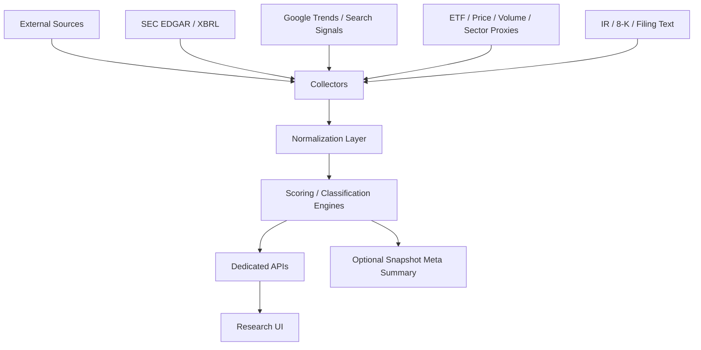

# Long-term Architecture: Company Fundamentals / Bottleneck / Narrative

## 목적

MacroSquare의 기존 강점인:

- 거시
- 레짐
- 자산 신호
- 실행 계획

위에 아래 3개 장기 기능을 **보조 레이어**로 추가한다.

1. 개별 기업 바텀업 분석
2. 병목 기업 후보 랭킹
3. 내러티브 단계 자동 판별

핵심 원칙:

- 기존 `snapshot / signals / allocation` 본체를 깨지 않는다.
- 초기에는 **별도 API / 별도 페이지**로 분리한다.
- 충분히 안정화된 뒤 `snapshot.meta` 요약으로 편입한다.

---

## 1. 전체 아키텍처 개요



---

## 2. Track A — 개별 기업 바텀업 분석

### 목표

기업별로 최소한 아래를 자동 계산한다.

- 성장성
- 수익성
- 밸류에이션
- 재무건전성
- 공시 이벤트

### 권장 서버 구조

- `/Users/lks/Desktop/project/trading-square/server/src/collectors/sec/`
  - `submissions.ts`
  - `companyfacts.ts`
  - `filings.ts`
  - `ticker-map.ts`
- `/Users/lks/Desktop/project/trading-square/server/src/engines/fundamentals/`
  - `normalize-financials.ts`
  - `growth-score.ts`
  - `quality-score.ts`
  - `valuation-score.ts`
  - `balance-sheet-score.ts`
  - `company-score.ts`
- `/Users/lks/Desktop/project/trading-square/server/src/types/fundamentals.ts`
- `/Users/lks/Desktop/project/trading-square/server/src/routes/company.ts`

### 데이터 흐름

1. ticker → cik 매핑
2. SEC submissions/companyfacts 수집
3. 분기/연간 팩트 normalize
4. 점수 계산
5. `/api/company/:ticker` 제공

### 핵심 타입 초안

```ts
interface CompanyFinancialSnapshot {
  ticker: string;
  cik: string;
  asOf: string;
  revenueTtm?: number;
  operatingIncomeTtm?: number;
  netIncomeTtm?: number;
  freeCashFlowTtm?: number;
  cash?: number;
  debt?: number;
  sharesOutstanding?: number;
}

interface CompanyScore {
  ticker: string;
  growthScore: number;
  qualityScore: number;
  valuationScore: number;
  balanceSheetScore: number;
  totalScore: number;
  reasons: string[];
}
```

### 공식 소스

- [SEC EDGAR API Documentation](https://www.sec.gov/edgar/sec-api-documentation)

### Phase 1 MVP 범위

- 매출 성장률
- 영업이익률
- FCF
- 순현금/순부채
- EV/Sales
- EV/FCF
- 종합 점수

### Phase 2 확장

- 8-K Item 2.02 earnings release 수집
- IR 자료/발표자료 메타데이터 수집
- peer 비교

---

## 3. Track B — 병목 기업 후보 랭킹

### 목표

완전 자동 선별보다 먼저:

- 후보군 정의
- 후보군 내 점수화

를 구현한다.

### 권장 서버 구조

- `/Users/lks/Desktop/project/trading-square/server/src/domain/bottleneck/`
  - `candidate-map.ts`
  - `keyword-rules.ts`
  - `bottleneck-score.ts`
- `/Users/lks/Desktop/project/trading-square/server/src/collectors/industry/`
  - `filing-keywords.ts`
  - `trade-data.ts`
- `/Users/lks/Desktop/project/trading-square/server/src/types/bottleneck.ts`

### 설계 전략

#### 1) 후보군 사전

예:

- 반도체 장비
- EDA
- AI 전력/변압기
- 냉각/열관리
- 방산 핵심부품

#### 2) 점수 요소

- supply constraint
- lead time
- backlog
- pricing power
- concentration
- margin resilience
- CAPEX cycle linkage

#### 3) 출력 예시

```ts
interface BottleneckCandidateScore {
  theme: string;
  ticker: string;
  score: number;
  componentScores: {
    textSignal: number;
    quality: number;
    concentration: number;
    supplyTightness: number;
  };
  reasons: string[];
}
```

### 현실적 구현 원칙

- “기업 자동 발굴”보다
- “정의된 후보 universe 내 랭킹”

이 1차 목표다.

---

## 4. Track C — 내러티브 단계 자동 판별

### 목표

테마별로:

- 초기
- 중반
- 과열

을 프록시 기반으로 판정한다.

### 권장 서버 구조

- `/Users/lks/Desktop/project/trading-square/server/src/collectors/trends/`
  - `google-trends.ts`
  - `youtube-search.ts`
  - `news-volume.ts`
- `/Users/lks/Desktop/project/trading-square/server/src/engines/narrative/`
  - `theme-map.ts`
  - `heat-score.ts`
  - `stage-classifier.ts`
- `/Users/lks/Desktop/project/trading-square/server/src/types/narrative.ts`

### 입력 프록시

- Google Trends
- YouTube 검색/콘텐츠량
- ETF 유입
- 가격 이격
- 거래량 급증
- 공시/뉴스 키워드 빈도

### 출력 예시

```ts
interface NarrativeThemeState {
  theme: string;
  stage: 'EARLY' | 'MID' | 'OVERHEATED';
  heatScore: number;
  drivers: string[];
}
```

### 예시 테마

- `AI_POWER`
- `DEFENSE_REARM`
- `GRID_CAPEX`
- `SAFEHAVEN_GOLD`

---

## 5. 기존 MacroSquare와의 연결 방식

### 1단계: 별도 API

- `/api/company/:ticker`
- `/api/bottleneck/:theme`
- `/api/narrative/:theme`

### 2단계: 별도 UI

- `/research`
- `/company/[ticker]`

### 3단계: snapshot meta 편입

- `meta.companyHighlights`
- `meta.narratives`
- `meta.bottleneckWatchlist`

### 4단계: signals/execution 보조 근거

예:

- 나스닥 설명에 `AI_POWER=MID`
- 금 설명에 `SAFEHAVEN_GOLD=OVERHEATED`

---

## 6. 프론트 권장 구조

- `/Users/lks/Desktop/project/trading-square/client/src/app/research/page.tsx`
- `/Users/lks/Desktop/project/trading-square/client/src/app/company/[ticker]/page.tsx`

신규 컴포넌트:

- `CompanyScoreCard.tsx`
- `NarrativeHeatPanel.tsx`
- `BottleneckWatchlist.tsx`

---

## 7. 구현 우선순위

### Phase 1

기업 바텀업 팩트 레이어

- SEC collector
- fundamentals normalize
- company score API

### Phase 2

내러티브 heat score

- theme map
- stage classifier
- UI panel

### Phase 3

병목 후보 랭킹

- candidate map
- keyword engine
- bottleneck score

---

## 8. Phase 1 상세 TODO — Company Fundamentals

### 8-1. 타입

파일:

- `/Users/lks/Desktop/project/trading-square/server/src/types/fundamentals.ts`

TODO:

- `CompanyFinancialSnapshot`
- `CompanyScore`
- `CompanyFilingEvent`
- `CompanyProfile`

---

### 8-2. ticker → cik 매핑

파일:

- `/Users/lks/Desktop/project/trading-square/server/src/collectors/sec/ticker-map.ts`

TODO:

- SEC ticker mapping 다운로드/캐시
- ticker 입력 정규화
- cik lookup 함수 제공

---

### 8-3. SEC submissions 수집

파일:

- `/Users/lks/Desktop/project/trading-square/server/src/collectors/sec/submissions.ts`

TODO:

- 회사 최근 filing index 수집
- 10-K / 10-Q / 8-K 메타 반환

---

### 8-4. companyfacts 수집

파일:

- `/Users/lks/Desktop/project/trading-square/server/src/collectors/sec/companyfacts.ts`

TODO:

- revenue
- operating income
- net income
- cash
- debt
- capex
- shares outstanding

를 raw fact로 수집

---

### 8-5. 재무 normalize

파일:

- `/Users/lks/Desktop/project/trading-square/server/src/engines/fundamentals/normalize-financials.ts`

TODO:

- annual / quarterly 기준 통합
- TTM 계산
- 누락/중복 period 정리

---

### 8-6. 점수 엔진

파일:

- `growth-score.ts`
- `quality-score.ts`
- `valuation-score.ts`
- `balance-sheet-score.ts`
- `company-score.ts`

TODO:

- 성장 점수
- 수익성 점수
- 밸류 점수
- 재무건전성 점수
- 종합 점수

---

### 8-7. 라우트

파일:

- `/Users/lks/Desktop/project/trading-square/server/src/routes/company.ts`

TODO:

- `GET /api/company/:ticker`
- response:
  - profile
  - financial snapshot
  - company score
  - recent filings

---

### 8-8. 테스트

파일:

- `/Users/lks/Desktop/project/trading-square/server/src/__tests__/companyfacts.test.ts`
- `/Users/lks/Desktop/project/trading-square/server/src/__tests__/company-score.test.ts`

TODO:

- normalize correctness
- missing period handling
- score consistency

---

## 9. 구현 시 주의

- 기존 `snapshot` 본체에 바로 결합하지 않는다.
- 먼저 **독립 API + 독립 UI**로 안정화한다.
- 병목/내러티브는 처음부터 정답형 자동화로 접근하지 않는다.
- “설명 가능한 점수화”를 우선한다.

---

## 10. 최종 권장 순서

1. 기업 팩트 수집
2. 기업 점수 엔진
3. 내러티브 heat score
4. 병목 후보 랭킹

