# MacroSquare 아키텍처 다이어그램

> Mermaid를 지원하는 GitHub, Codex, Notion 연동 Markdown viewer에서 바로 렌더링된다. 원본은 [`diagrams/`](diagrams/)에도 분리했다.

## 1. 프로덕션 런타임

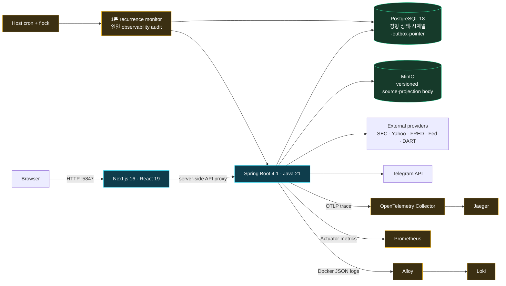

### 포트·보안 경계

- 사용자 진입점은 Next.js 하나로 제한한다.
- Spring, PostgreSQL, MinIO, Jaeger, Prometheus, Loki는 loopback 또는 compose private network에 둔다.
- MinIO bucket은 private/versioned이며 애플리케이션 계정에는 Get/List/Put만 부여하고 delete를 제외한다.
- 컨테이너는 가능한 범위에서 `no-new-privileges`, capability drop, read-only filesystem, non-root를 적용한다.

## 2. Clean Architecture와 bounded context

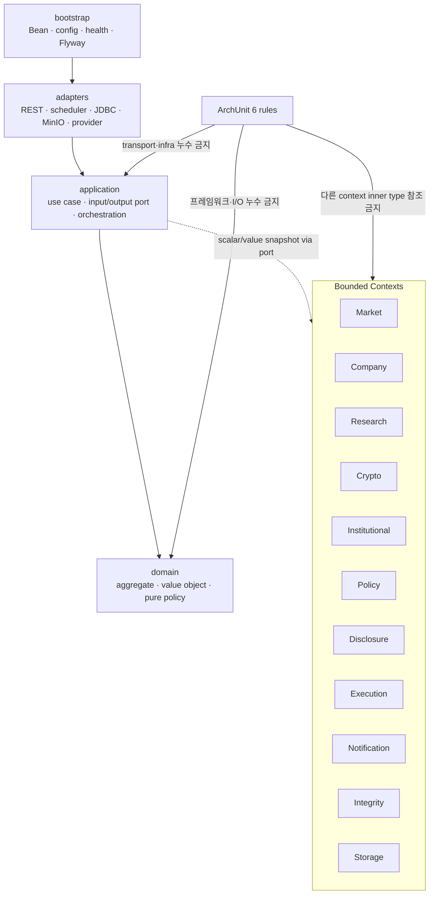

### 강제 규칙

1. domain은 Spring, Jackson, JDBC, MinIO, HTTP, 파일, concurrency 패키지에 의존하지 않는다.
2. application은 adapter/bootstrap, controller DTO, SQL, provider 응답 타입을 모른다.
3. Controller는 inbound web adapter에만 둔다.
4. Scheduler는 cluster-exclusive execution port를 반드시 사용한다.
5. 한 context의 inner layer가 다른 context를 shared library처럼 사용하지 않는다.

## 3. 원천 데이터에서 사용자 판단까지

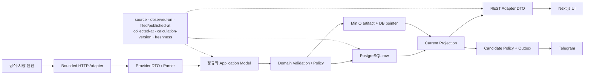

핵심은 화면 갱신시각이 금융 기준일을 덮어쓰지 않는 것이다. 원천의 `observed_on`, 공시일, 수집시각, 계산 버전과 freshness를 가능한 범위에서 끝까지 보존한다.

## 4. 기업 투자판단 스택

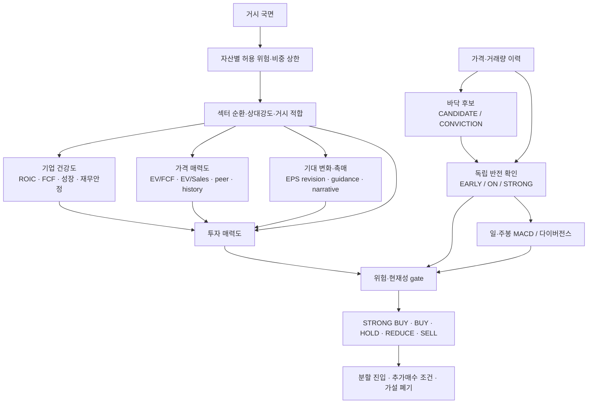

### 설계 의도

- 많이 떨어진 종목과 실제 반전이 확인된 종목을 구분한다.
- MACD는 다른 점수와 섞지 않고 timing evidence로 유지한다.
- 데이터 품질과 위험 gate는 높은 점수보다 우선한다.
- UI는 서버의 action을 재계산하지 않고 근거와 주의 문구를 번역한다.

## 5. PostgreSQL–MinIO 일관성

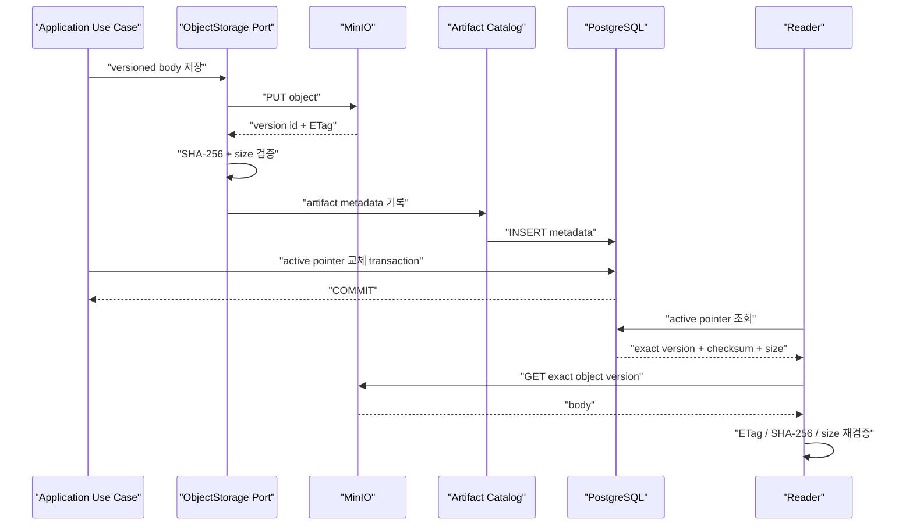

### 장애 의미

- object 저장 실패: pointer 변경 없음, 기존 last-valid 유지
- metadata/pointer commit 전 실패: orphan 가능, reader에게 비노출
- pointer가 없는 object: maintenance GC 대상
- pointer가 가리키는 object 없음 또는 checksum 불일치: CRITICAL integrity incident
- XA/2PC 대신 immutable body + transactional pointer로 복잡도를 제한

## 6. 알림 transactional outbox

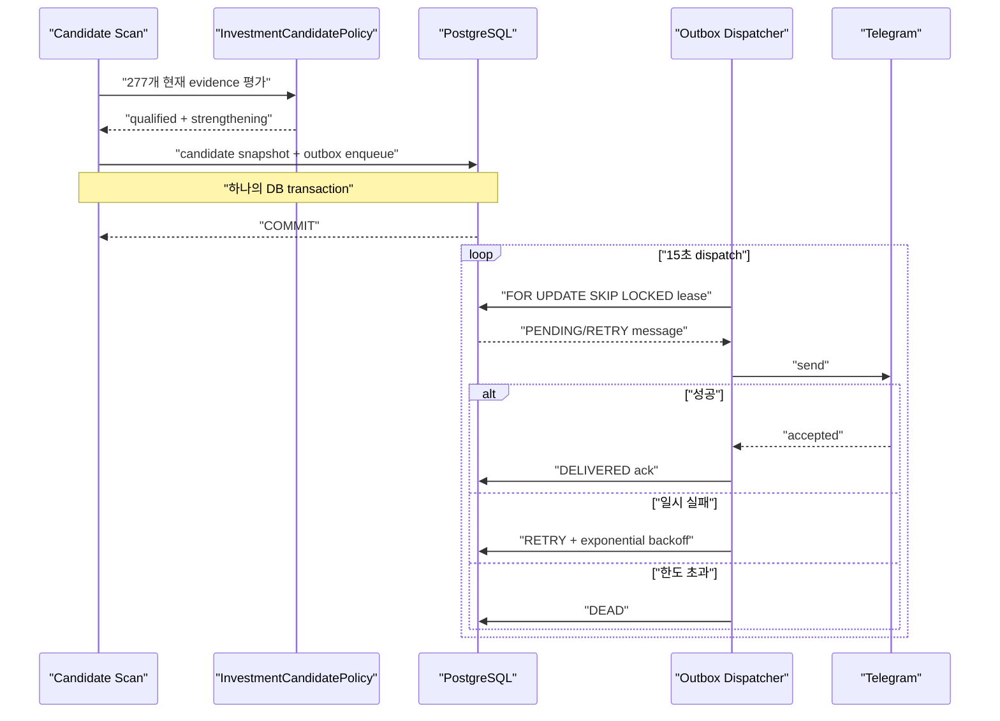

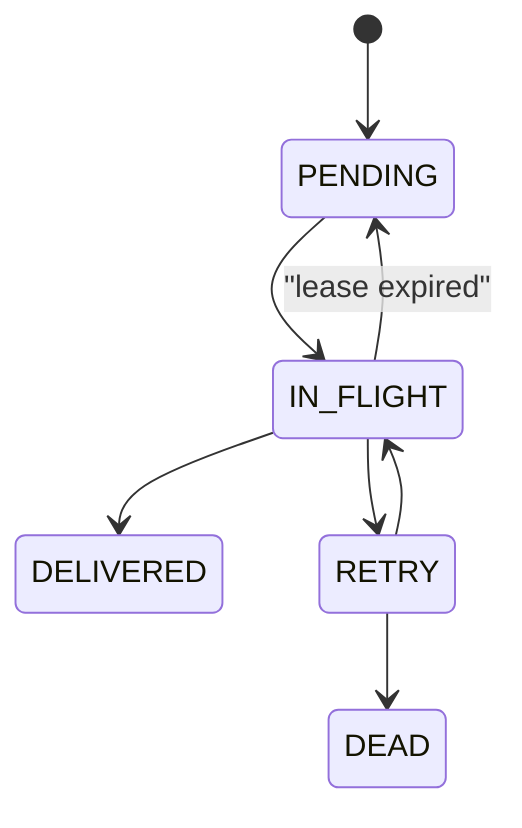

## 7. Scheduler·동시성·rate limit

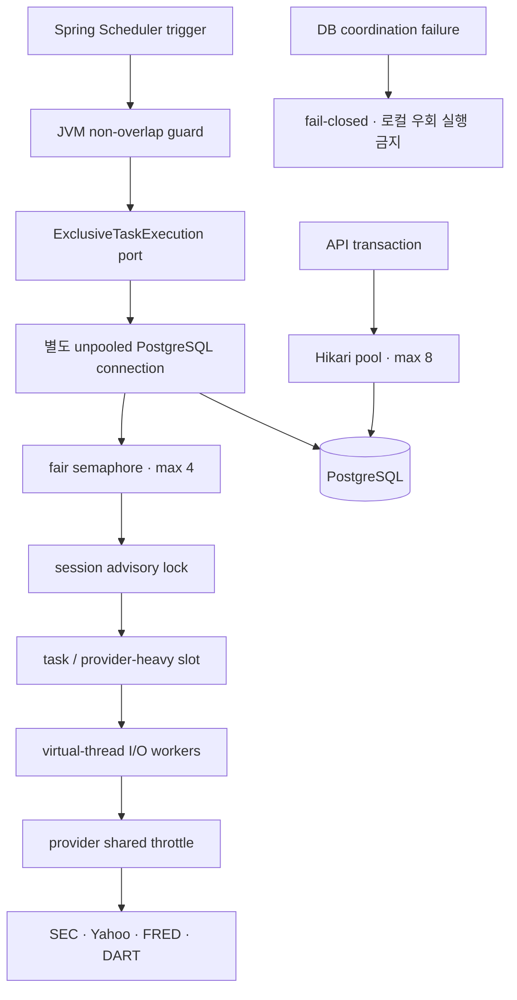

외부 API가 느릴 때 scheduler가 Hikari connection을 장시간 점유하면 사용자 API까지 고갈될 수 있다. 그래서 조정용 session connection과 업무 transaction pool을 물리적으로 분리했다.

## 8. 시작 시 부하 분산

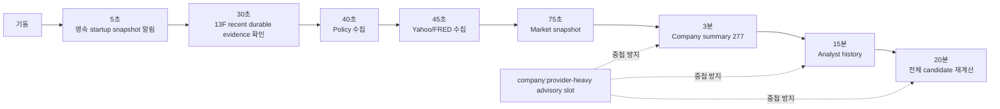

## 9. 배포·자동 롤백

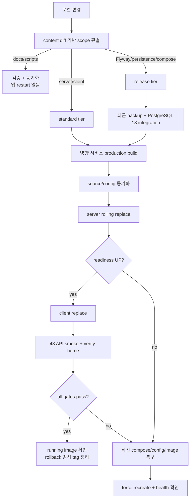

## 10. 핵심 데이터 모델

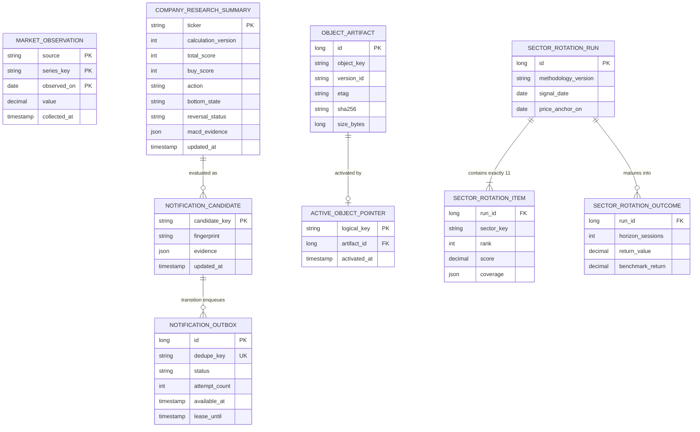

이 ERD는 포트폴리오 설명을 위한 개념 축약이다. 실제 DDL은 Flyway V1–V22와 schema ownership 문서가 기준이다.

## 11. 장애 대응 폐쇄 루프

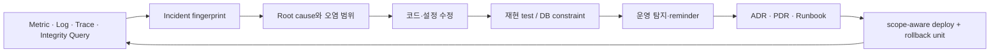

완료 기준은 “오류 로그가 잠시 사라짐”이 아니라 **원인 수정, 자동 재현, 운영 재탐지, 롤백 가능성**이다.
